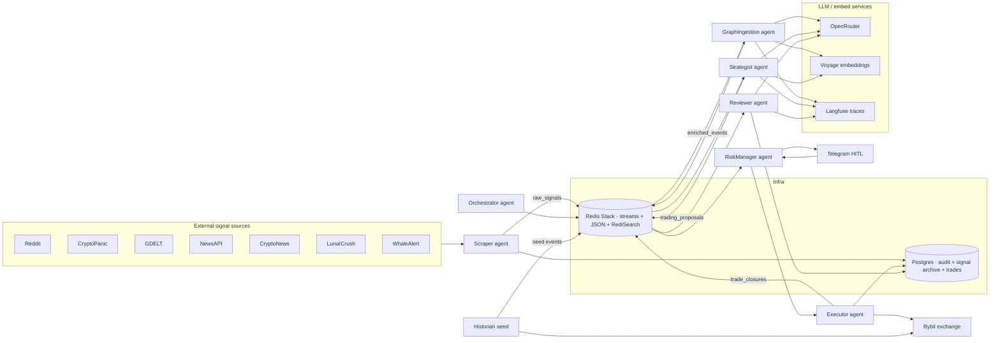

# Plata — System architecture

Last updated by the dashboard refactor in **v2.24.031**. Keep this file in sync with code changes; the in-app Activity page no longer renders a Mermaid diagram.

## High-level diagram

## Services (Railway)

Three containers, all built from the same Dockerfile, dispatched by `SERVICE_ENTRYPOINT`:

| Service | Entrypoint | Runs |
|---|---|---|
| `ingestion_hub` | `plata.entrypoints._run_ingestion_hub` | Orchestrator · Scraper · TelegramBot · Dashboard (FastAPI) |
| `intelligence_sandbox` | `plata.entrypoints._run_intelligence_sandbox` | GraphIngestion · Strategist · Reviewer |
| `execution_vault` | `plata.entrypoints._run_execution_vault` | RiskManager · Executor |

Secret scoping:
- `BYBIT_API_KEY` / `BYBIT_API_SECRET` — execution_vault only
- `TELEGRAM_BOT_TOKEN` / `TELEGRAM_ALLOWED_USER_IDS` — ingestion_hub only
- `REDIS_URL`, `POSTGRES_URL`, `OPENROUTER_API_KEY`, `VOYAGE_API_KEY` — all three
- Dashboard auth: `DASHBOARD_SESSION_SECRET`, `DASHBOARD_ADMIN_EMAIL`, `DASHBOARD_ADMIN_PASSWORD`

## Redis schema

| Key pattern | What |
|---|---|
| `raw_signals:stream` | Scraper → GraphIngestion |
| `enriched_events:stream` | GraphIngestion → Strategist |
| `trading_proposals:stream` | Strategist → RiskManager |
| `trade_closures:stream` | Executor → Reviewer |
| `heartbeats:stream` | All agents → Orchestrator |
| `dlq:<stream>` | Dead-letter stream per source |
| `event:<ulid>` | JSON doc, indexed by `idx:event` (RediSearch + HNSW on `$.embedding`) |
| `entity:<type>:<id>` | JSON doc, indexed by `idx:entity` |
| `edge:<src>:<rel>:<dst>` | JSON edge doc |
| `agent_status:<name>` | Hash: heartbeat, in_flight, halted, container |
| `agent_stats:<name>` | Hash: processed_total, errors_total, dropped_<reason> |
| `agent_activity:<name>` | List: last 50 actions (ISO\|kind\|summary) |
| `dlq:stats:<agent>` | Hash counters |
| `scraper:source:<name>` | Hash: status, last_poll_at, last_fetched, interval_sec |
| `historian:status` | Hash: state, written, total_target, started_at, last_progress_at |
| `system:state` | "RUNNING" / "HALTED" |
| `pending_approval:<ulid>` | Pending HITL proposal payload |
| `risk_config` | Hash of live config; mirror of latest version in Postgres |
| `cost:daily:<date>` / `cost:daily:<date>:agent:<name>` | LLM spend counters |

## Postgres schema (Alembic)

- `users` — dashboard auth (argon2 hashes)
- `audit_log` — intentional actor actions (HITL decisions etc.)
- `error_log` — captured exceptions/warnings from all agents
- `signal_archive` — every scraped signal, dup-flagged
- `trade_ledger` — opened/closed trades with proposal_id, OHLCV at entry/exit
- `event_price_windows` — pre/post OHLCV bars saved by the oracle for analog lookups
- `config_settings` — versioned risk-config history
- `backtest_runs` / `backtest_trades`

## Pub/sub channels

- `system:halt` — broadcast halt; payload may include `{agent: "<name>"}` for per-agent halt
- `system:resume` — counterpart
- `config_updated` — risk-config changes
- `approval:<proposal_ulid>` — HITL decision notification

## Agents (single-page summary)

| Agent | Consumes | Produces | Notes |
|---|---|---|---|
| **Scraper** | external HTTP | `raw_signals` | One source per poll loop; per-source status hash; ddup'd against `signal_archive` |
| **GraphIngestion** | `raw_signals` | `enriched_events`, `event:*`, `entity:*`, `edge:*` | LLM JSON-schema extraction; Voyage embed; RediSearch index |
| **Strategist** | `enriched_events` | `trading_proposals` | KNN over past events; ranks analogs; LLM decides go/no-go + sizing |
| **RiskManager** | `trading_proposals` | (via approval store / HITL) | Position-size, daily-loss caps, paper-mode gate |
| **Executor** | (HITL-approved) | `trade_closures`, `trade_ledger` | Bybit perp orders; paper-mode is fully simulated |
| **Reviewer** | `trade_closures` | `audit_log`, updates `entity_refs.trade_outcome` on events | Post-mortems via LLM |
| **Orchestrator** | `heartbeats` + Redis scan loops | `system:halt` (auto) | Watchdog for dead agents + DLQ spikes |
| **TelegramBot** | Telegram getUpdates + `approval:*` | Telegram messages | HITL approve/reject UI |
| **Historian** | LLM + Bybit OHLCV | `event:*` with `price_impact` | One-shot seed; can be re-run from `/historian/` |

## Dashboard pages

- `/` Overview tiles + recent feeds (smart links per tile)
- `/workflow/` Kanban: Sleeping / Active / Ready / Doing / Done
- `/activity/` Pipeline depths, per-agent counters, recent signals
- `/history/` Unified timeline of signals + decisions + trades + errors
- `/graph/` Cytoscape.js knowledge-graph explorer
- `/historian/` Seed runner with brief + focus + date window
- `/agents/` Per-agent health + LLM spend
- `/proposals/` Pending HITL
- `/trades/` Ledger; click row → `/trades/<ulid>` decision chain
- `/errors/` Error log with copy/clear
- `/dlq/` Dead-letter queues with throttled replay
- `/settings/?tab=…` Controls / Risk Config / Account / Environment
